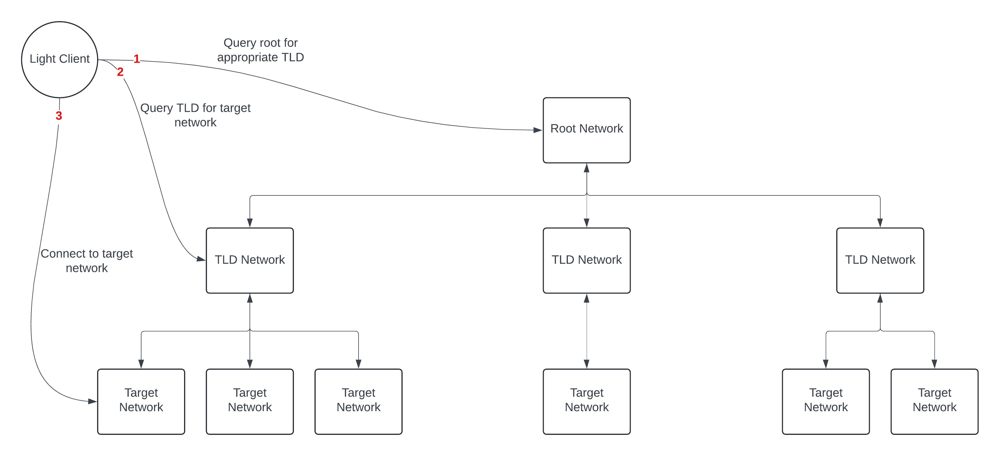
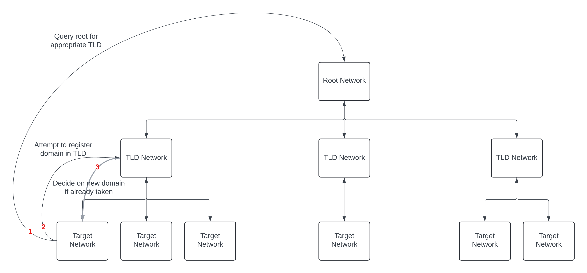

# BCDNS

This projects aims to create a discovery mechanism inspired by traditional DNS for the interoperability of blockchain networks. Using this approach, private blockchain networks can choose to opt-in and make themselves discoverable by claiming a *domain* and registering it on the appropriate networks. Once registered, a recursive query can be made to resolve the claimed domain and find the `chain specifications` to be used to connect to the target network.

The discovery of blockchain networks subsequently leads to the discovery of assets within said networks. A node/light-client can query the DNS architecture for the chain specifications associated with a given domain. If permitted, it can then query the target chain for the information associated with a specific asset. Interestingly, this can all be implemented in a very familiar fashion to end-users:

```bash
domain.tld/assetId
```

The flexibility of this approach is shown in its ease of extensibility. For example, if assets were not the only information required by the user, the protocol can easily be modified as follows, essentially acting as an interface to the different substrate modules included in the node:

```bash
domain.tld/asset/assetId # For assets
domain.tld/balance/accountId # For account balances
```

Finally, the incentive for maintaining both the Root and TLD networks (shown in the protocol diagrams) partially lies in the desire for target networks to be discoverable. If the DNS infrastructure were not maintained, they would not be discoverable through it and would consequently lose a considerable amount of traffic. Moreover, the nodes are also incentivized from a monetary perspective since domain registration/modification/revocation requires transactions to be handeled, which will contain gas fees for nodes to prioritize the finalization of different transactions.

## Protocol Diagrams
### Domain name querying


### Domain name registration
