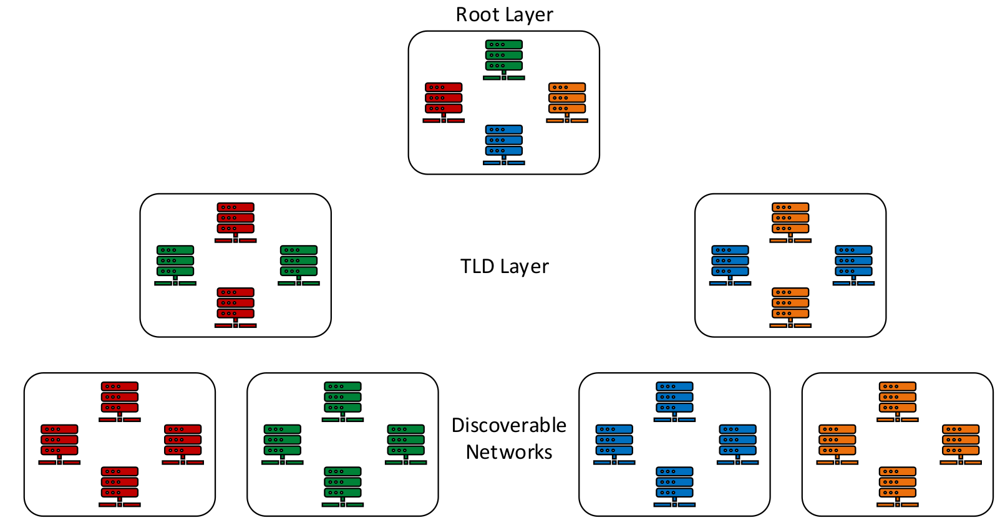
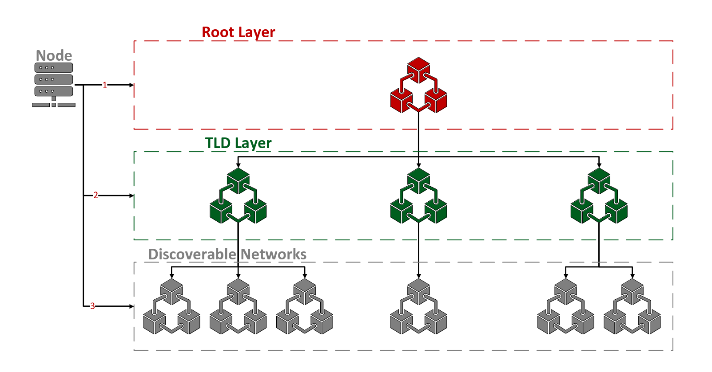
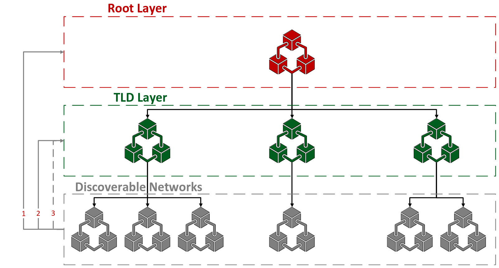
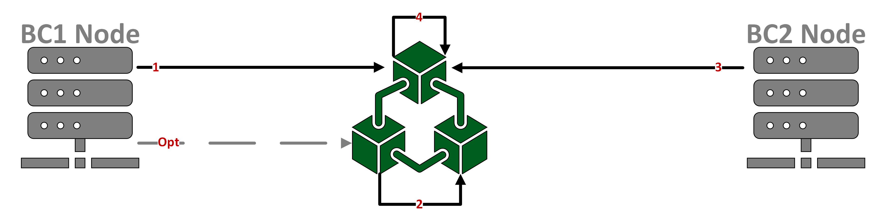
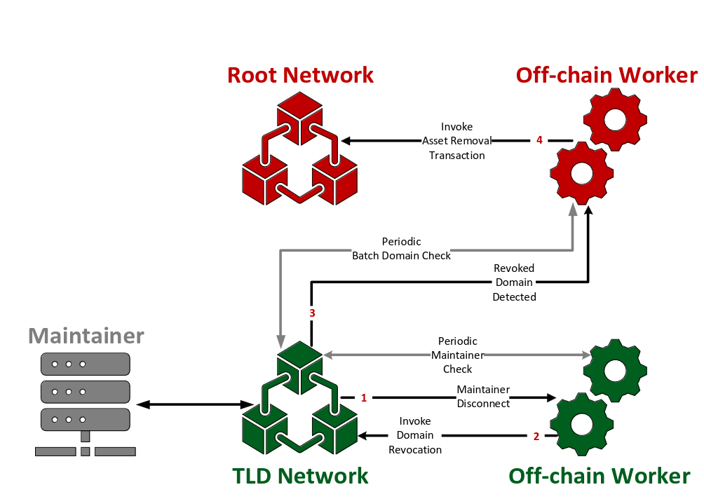

# Enabling Blockchain Interoperability Through Discovery

This projects aims to create a discovery mechanism inspired by traditional DNS
for the interoperability of blockchain networks. The main goals of this design
are to:

1. Maximize the decentralization of the discovery mechanism
2. Ensure that the solution is scalable
3. Allow for dynamic discovery services by enabling networks to voluntarily
   opt-in or opt-out.

To achieve this, we propose a multi-layered architecture for a blockchain- based
discovery mechanism. Inspired by the traditional DNS architecture, blockchain
network domains are organized into top-level domains (TLDs) as shown in the
figure below. A root net- work manages the TLD networks by storing their
connection information while remaining agnostic of individual domain details.



## Launching a Node

To launch a node for testing pallet functionality, it must first be compiled by
running the following inside the node's directory:

```bash
cargo build --release
```

Then the node can be run for testing purposes using:

```bash
./target/release/node-template --dev
```

The pallets can then be interacted with through the
[polkadot explorer](https://polkadot.js.org/apps/#/explorer)

## Interaction Protocols

### Domain Resolution Protocol



The resolution protocol adheres to the following three steps:

1. **Root Query**:  
   A node or light client connects to the **root network**, whose connection details are static and globally known. The client queries the chain state of the root network to retrieve the connection details of the **TLD (Top-Level Domain)** network associated with the domain it seeks to resolve.

2. **TLD Query**:  
   Using the connection details obtained from the root network, the client establishes a connection with the appropriate TLD network. The client then queries the chain state of the TLD network to retrieve the connection details of the **specific sub-network** (associated with the desired domain or subdomain).

3. **Target Network Connection**:  
   The client uses the connection details from the TLD network to establish a direct connection with the **target network**. Once resolved, the connection details can be cached locally for future use, improving resolution efficiency for subsequent queries.

The implementation of the resolution protocol can be found in [dns_client](./dns_client/dns/resolver.js#L49-L61) and [dns_client_golang](./dns_client_golang/substrate/connect.go#L73-L94).

### Domain Registration Protocol



The registration protocol can be described as follows:

1. **Root Query**:  
   A node, selected by the network’s consensus mechanism, first connects to the **root network**. It queries the chain state to retrieve the connection details of the **TLD network** associated with the desired domain.

2. **Submit Transaction to TLD Layer**:  
   After obtaining the connection details of the TLD network, the selected node connects to the TLD network and submits a transaction to **register the domain**. This registration is processed and finalized based on the TLD network’s own rules.

3. **Retry for Alternative Domain** (Optional):  
   If the desired domain is already claimed, the network may decide on an alternative domain through its consensus mechanism. The process is repeated by querying the root layer and submitting a new transaction to the TLD network associated with the alternative domain. 

This protocol ensures that domains are registered on a **first-come, first-served** basis in a decentralized environment without relying on centralized registrars, incurring only the transaction fees for the registration process.

The implementation of the registration extrinsic can be found in the [tld-pallet](./polkadot-sdk-solochain-template/pallets/tld/src/lib.rs#L193-L220), and the implementation of the registration through the dns client can be found in [dns_client](./dns_client/dns/registry.js#L96-L120).

### Domain Transfer Protocol



The domain transfer protocol is as follows:

1. **Transfer Request by Initiator (BC1 Node)**:  
   The **BC1 Node** initiates the process by submitting a transaction to the TLD network. This transaction contains a **transfer request**, specifying the target recipient’s blockchain (BC2 Node) and relevant ownership transfer details.

2. **TLD Network Creates Pending Transfer**:  
   The TLD network receives the request and logs it as a **pending transfer** on the chain. This state ensures the transfer is recognized but not finalized until further confirmation.

3. **Recipient's Acceptance (BC2 Node)**:  
   A **representative node** from BC2 submits a transaction to the TLD network, confirming the acceptance of the transfer. Upon confirmation, the domain's ownership is officially updated to BC2.

4. **Optional Cancellation by Initiator**:  
   If the initiator (BC1 Node) decides to cancel the transfer **before the recipient accepts**, it can submit a cancellation request to the TLD network. This step will remove the pending transfer and halt the process.

The implementation of the domain revocation extrinsic can be found in the [tld-pallet](./polkadot-sdk-solochain-template/pallets/tld/src/lib.rs#L269-L323).

### Domain Revocation Protocol



The domain revocation protocol and its conditions are described as follows:

1. **Periodic Maintainer Check by Off-chain Worker**:  
   Off-chain workers periodically poll the TLD network to verify the activity status of maintainer nodes provided by beneficiary networks. If a maintainer node is found to be disconnected, it triggers the next step.

2. **Domain Revocation on TLD Network**:  
   Upon detecting a disconnected maintainer, the off-chain worker submits a domain revocation transaction to the TLD network. The domain claimed by the associated beneficiary network is marked as revoked on the TLD network.

3. **Periodic Domain Check by Root Network**:  
   The root network periodically queries the TLD network for domain revocation events. This ensures that the root network stays synchronized with the updated state of domains in the TLD network.

4. **Asset Removal on Root Network**:  
   If the root network detects a revoked domain, it initiates the removal of all associated asset references linked to the domain. This is done through an asset removal transaction to maintain data consistency across the architecture.

The implementation of the domain revocation extrinsic can be found in the [tld-pallet](./polkadot-sdk-solochain-template/pallets/tld/src/lib.rs#L247-L267).

## Testing

Each component has its own set of unit tests, and some contain guides for manual testing as well. The testing guides for each component can be found in the following files:

- [dns_client_golang/testing.md](./dns_client_golang/testing.md)
- [dns_client/testing.md](./dns_client/testing.md)

## Licensing

This project is licensed under the Apache License 2.0.