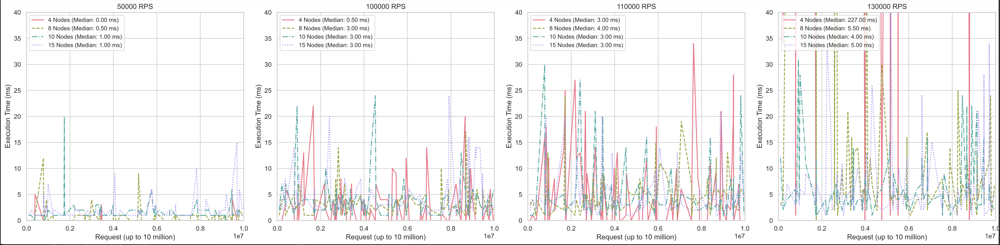

# Evaluation Results

The evaluation results are are shown in the following plots (PDF version contains the plots with a higher resolution):

All tests were performed on a system with an Intel Xeon Silver 4216 processor, 64 CPUs, 128GB of RAM, and 500GB of NVMe storage. The setup consisted of a root network and two TLD networks, each tested with 4, 8, 10, and 15 nodes in different scenarios. A total of 10 million requests were sent to the system, with concurrent loads ranging from 50,000 to 130,000 requests per second (rps).

At 50,000 rps, all configurations showed minimal latency, with median response times staying below 1 millisecond. As the load increased, response times rose accordingly. Both the 100,000 and 110,000 rps tests yielded similar median latencies, though higher than those at 50,000 rps. However, at 130,000 rps, the 4-node setup experienced a notable decline in performance, recording a median response time of 227 milliseconds—an expected result given the strain on smaller networks under heavy traffic. In contrast, the other configurations managed the 130,000 rps load efficiently, maintaining a maximum median latency of just 5.5 milliseconds, demonstrating the architecture's scalability with only a modest increase in nodes.